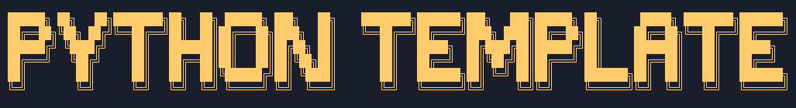

# Python GUI Application template



# About

Here is an empty template for make a gui python program 

## Vscode Task
 ```sh
 {
   "label": "py-gui",
   "type": "shell",
   "command": "mkdir assets/img build data dist docs gui/assets release src; touch .env.dist .gitignore .gitkeep README.md main.py requirements.txt "
 }
 ```
## Commands

 ```sh
mkdir assets/img build data dist docs gui/assets release src; 
touch .env.dist .gitignore .gitkeep README.md main.py requirements.txt;
 ```

💻💖 by [xSpartan155x](https://github.com/xSpartan155x)
